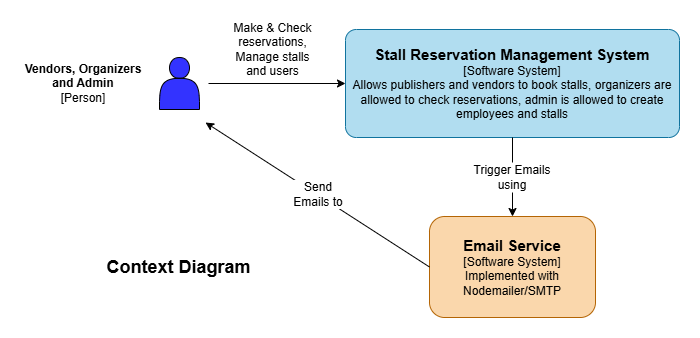
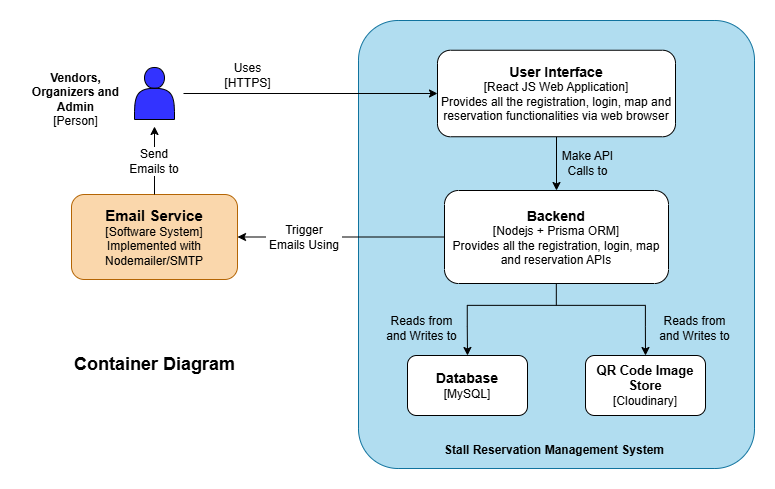
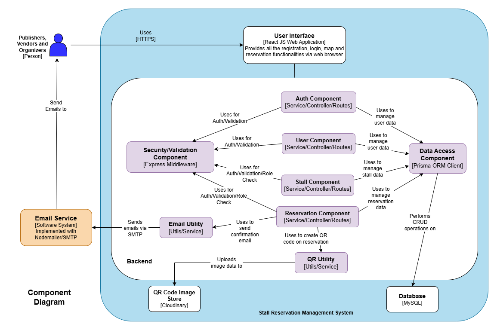
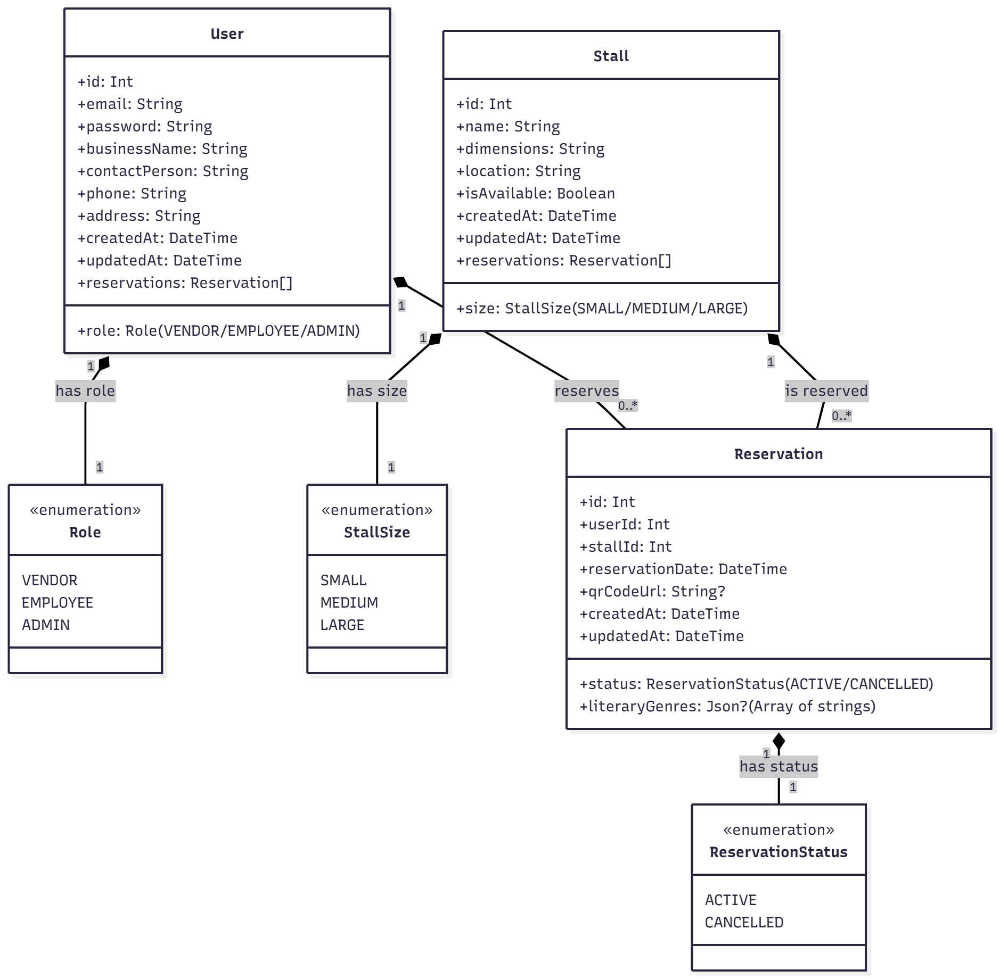

## Software Architecture Project

This project is a Book Fair Stall Reservation System consisting of two main parts: the backend API and the frontend client application.

---

## System Architecture Models (C4)

### 1. Level 1 – System Context Diagram


### 2. Level 2 – Container Diagram


### 3. Level 3 – Component Diagram


### 4. Level 4 – Code/Entity Diagram


---

## Project Overview

This system allows users to browse available stalls at a book fair, register accounts, make reservations for stalls, and manage those reservations. It is implemented as a full-stack application with a Node.js + Express backend and a React + TypeScript frontend.

---

## Backend Overview

The backend is a RESTful API built with Node.js, Express, TypeScript, and Prisma ORM. It manages user authentication, stall data, and reservations with MySQL as the database.

For detailed instructions and API documentation, please see the [backend README](./backend/README.md).

**Key Technologies:**
- Node.js
- Express.js
- TypeScript
- Prisma ORM
- MySQL
- JWT Authentication
- Cloudinary (for QR code image hosting)
- Nodemailer (email)

### Running the Backend

1. Install dependencies:
   ```bash
   cd backend
   npm install
   ```

2. Setup environment variables by copying `.env.example` to `.env` and filling in required values.

3. Generate Prisma client, run migrations, and optionally seed the database:
   ```bash
   npx prisma generate
   npx prisma migrate dev
   npx prisma db seed
   ```

4. Start the development server with hot reload:
   ```bash
   npm run dev
   ```

---

## Frontend Overview

The frontend is built using React, TypeScript, and Vite. It interacts with the backend API to provide a responsive user interface for managing reservations and stalls.

For detailed frontend development notes and configuration, please see the [frontend README](./frontend/README.md).

**Key Technologies:**
- React
- TypeScript
- Vite
- ESLint with recommended React and TypeScript rules

### Running the Frontend

1. Install dependencies:
   ```bash
   cd frontend
   npm install
   ```

2. Start the development server:
   ```bash
   npm run dev
   ```

---

## Folder Structure

```
/
├── backend/        # Backend API source and configurations
├── frontend/       # Frontend client application source and configurations
├── README.md       # This file - project overview and instructions
```

---

## Prerequisites

- Node.js (v16 or higher)
- npm or yarn
- MySQL database (for backend)
- Recommended code editor: Visual Studio Code

---

## Technologies Used

- Backend: Node.js, Express.js, TypeScript, Prisma, MySQL, JWT, Cloudinary, Nodemailer
- Frontend: React, TypeScript, Vite, ESLint

---

## Contact

For questions or contributions, please open issues or pull requests in the repository.
